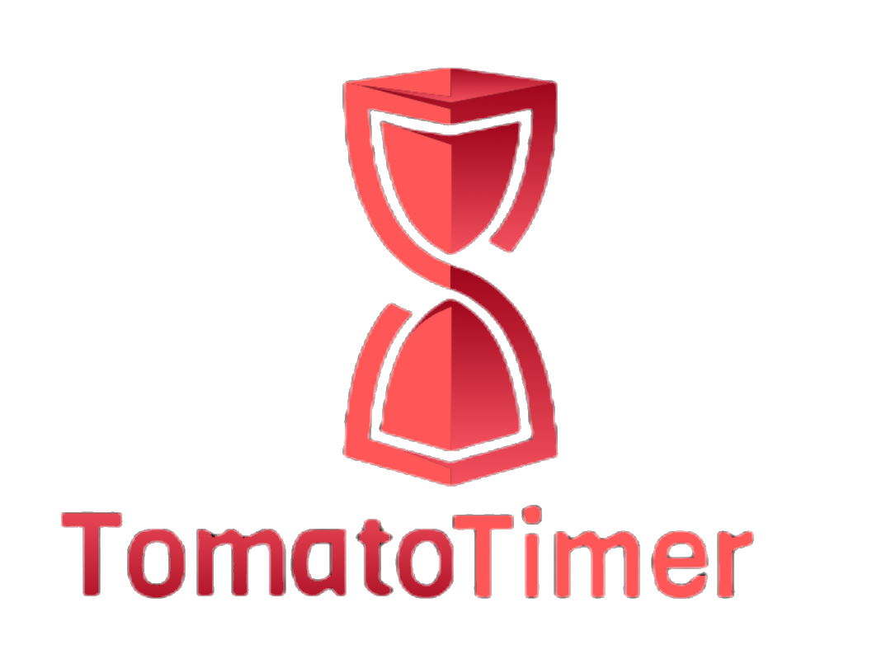

<!-- PROJECT LOGO -->
<br />
<p align="center">
  <a href="https://github.com/othneildrew/Best-README-Template">
    
  </a>
  
  <p align="center">
    A tangy experience to manage your time effectively!
    <br />
    <a href="https://github.com/othneildrew/Best-README-Template/issues">Report Bug</a>
    ·
    <a href="https://github.com/othneildrew/Best-README-Template/issues">Request Feature</a>
  </p>
</p>


<!-- TABLE OF CONTENTS -->
## Table of Contents

- [Table of Contents](#table-of-contents)
- [About The Project](#about-the-project)
  - [Inspiration](#inspiration)
- [Screenshot](#screenshot)
- [Features:](#features)
- [Built With](#built-with)
- [Installation](#installation)
- [Usage](#usage)
- [Roadmap](#roadmap)
- [License](#license)


<!-- ABOUT THE PROJECT -->
## About The Project
### Inspiration

In our daily work, when we are looking forward to delivering the best results, we sometimes need a laser-like focus on some tasks.
But, there are other things we need to take care of, such as that email, that presentation. 
And we follow dynamic scheduling subconsciously then do busywork throughout the day.

This a good [post](https://buffer.com/resources/work-less/) on replacing busy work with efficient work.

The [Pomodoro Technique](https://en.wikipedia.org/wiki/Pomodoro_Technique) is a time management method that uses a timer to break down work into intervals, traditionally 25 minutes in length.
The goal of the technique is to reduce the impact of internal and external interruptions on focus and flow.

For enforcing this technique quickly each time, I developed a minimal Taskbar tool that can be instantly started and tracked.

## Screenshot
<p align="center">

</p>

## Features:
1. Supports manual cancellation with accuracy.
2. Message pop-up with beep sound to notify the timer expiry.
3. No pause provided to let the user focus on current task.
4. Minimal interface.
5. Tracking in minutes only.

## Built With
* [Winforms](https://github.com/dotnet/winforms)
* [CSDeskBand](https://github.com/dsafa/CSDeskBand)
* [TPL](https://docs.microsoft.com/en-us/dotnet/standard/parallel-programming/task-parallel-library-tpl)

## Installation
1. Download ```TomatoTimer.zip``` from the latest [release](https://github.com/rexwulf/TomatoTimer/releases).
2. Run ```InstallWidget.bat``` as an Administrator.
3. Restart Windows Explorer from the Task Manager (```CTRL+SFT+ESC```).
4. Right-click on Taskbar, go to Toolbars, and select "Tomato Timer".


<p align="center">

</p>

## Usage
1. Right-click the clock icon in the Taskbar.
2. Select a time window out of the given options.
   <p align="center">
   
   </p>
3. Now a live counter of no. of minutes remaining will be displayed besides the clock icon.
4. To stop or reset the timer (not pause), select the ```Stop``` option from the menu.
5. Once the timer expires or the user cancels it, a message popup will notify the user.
   
   <p align="center">
   
   </p>


<!-- ROADMAP -->
## Roadmap

See the [open issues](https://github.com/othneildrew/Best-README-Template/issues) for a list of proposed features (and known issues).


<!-- LICENSE -->
## License

Distributed under the GPL License. See `LICENSE` for more information.


<!-- MARKDOWN LINKS & IMAGES -->
<!-- https://www.markdownguide.org/basic-syntax/#reference-style-links -->
[contributors-shield]: https://img.shields.io/github/contributors/othneildrew/Best-README-Template.svg?style=flat-square
[contributors-url]: https://github.com/othneildrew/Best-README-Template/graphs/contributors
[forks-shield]: https://img.shields.io/github/forks/othneildrew/Best-README-Template.svg?style=flat-square
[forks-url]: https://github.com/othneildrew/Best-README-Template/network/members
[stars-shield]: https://img.shields.io/github/stars/othneildrew/Best-README-Template.svg?style=flat-square
[stars-url]: https://github.com/othneildrew/Best-README-Template/stargazers
[issues-shield]: https://img.shields.io/github/issues/othneildrew/Best-README-Template.svg?style=flat-square
[issues-url]: https://github.com/othneildrew/Best-README-Template/issues
[license-shield]: https://img.shields.io/github/license/othneildrew/Best-README-Template.svg?style=flat-square
[license-url]: https://github.com/othneildrew/Best-README-Template/blob/master/LICENSE.txt
[linkedin-shield]: https://img.shields.io/badge/-LinkedIn-black.svg?style=flat-square&logo=linkedin&colorB=555
[linkedin-url]: https://linkedin.com/in/othneildrew
[product-screenshot]: images/screenshot.png
